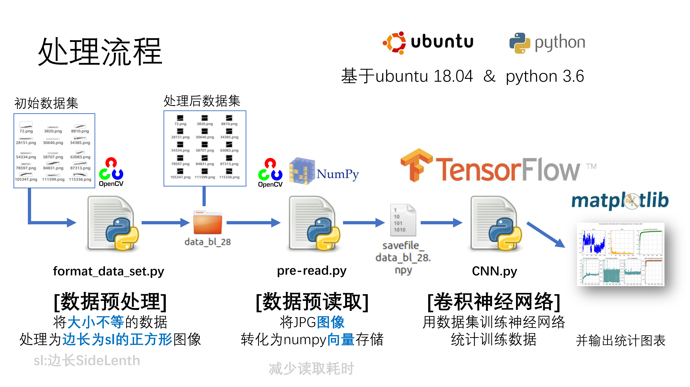
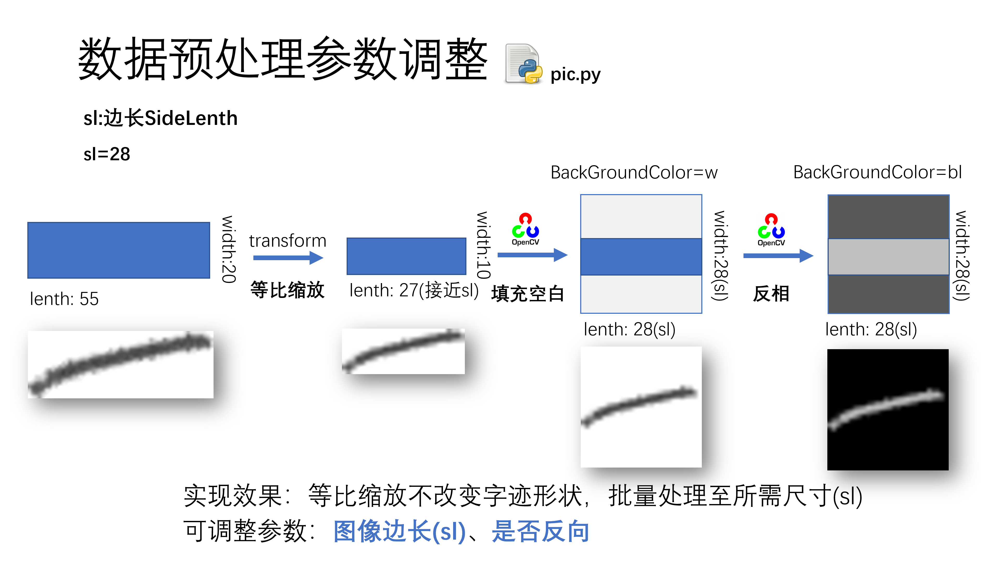
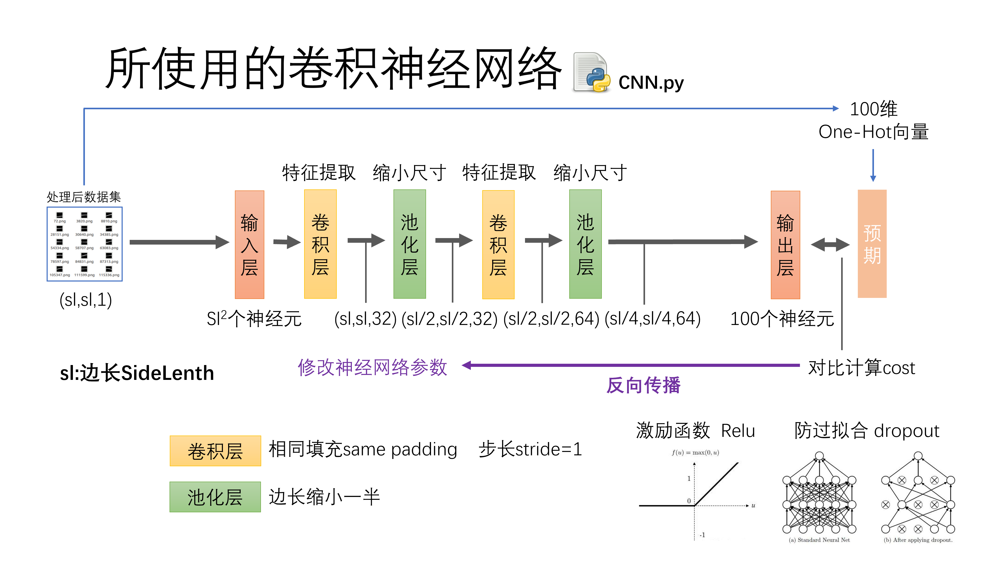
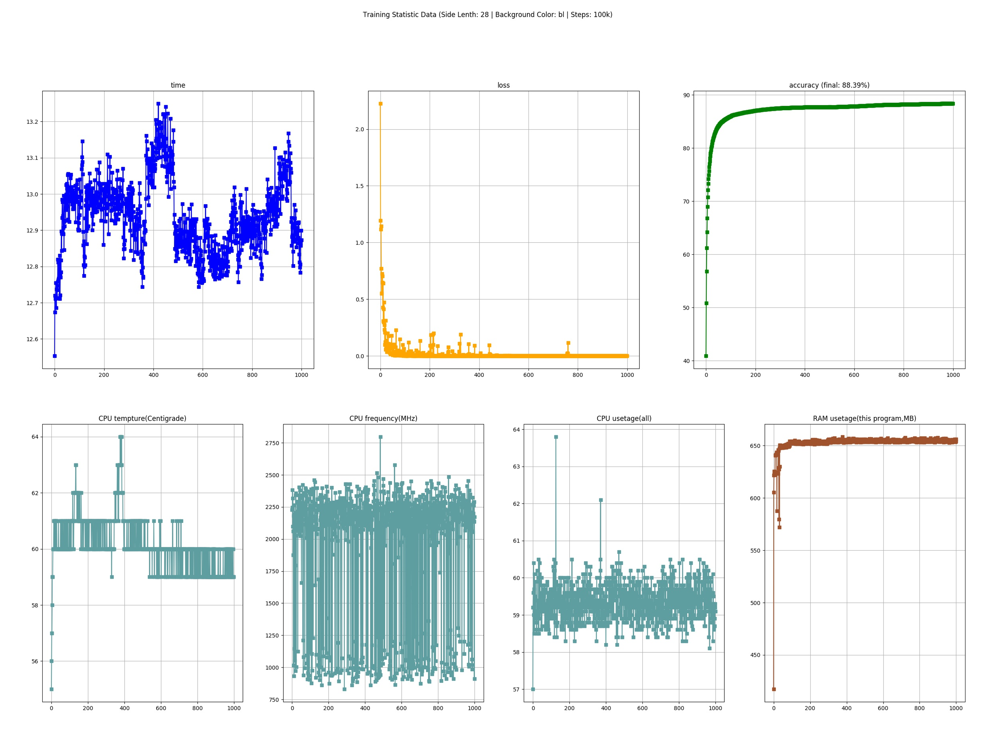
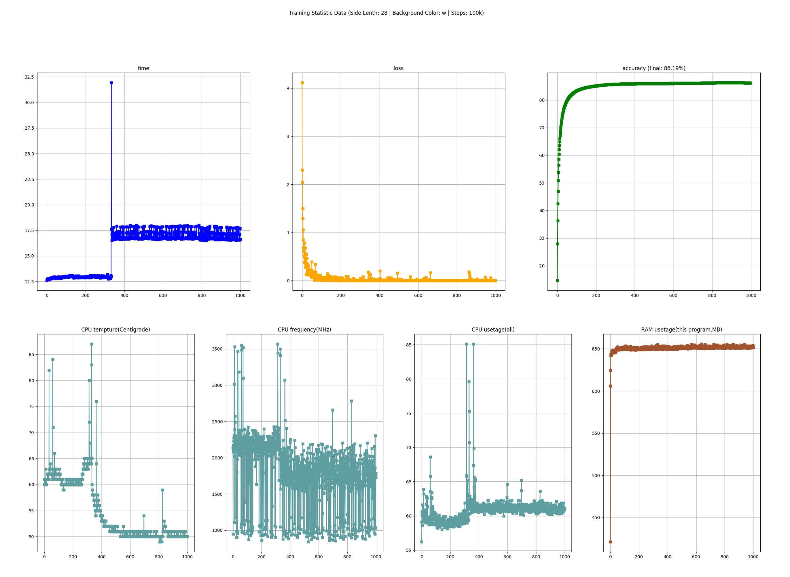

# handwritten_Chinese_recognition

本项目实现手写部分汉字识别，并对其训练数据集对训练的结果进行研究。

本项目于2019年10月进行，由于数据集所属权的原因放在私有仓库，此公开仓库是无数据集（仅保留6张作为代表）的版本。

感谢 付鹏斌 老师对此项目的指导与支持，感谢 [@leoleoasd](https://github.com/leoleoasd) 的交流和帮助。

## 项目简介

### 数据集处理流程

数据集的图像大小不等，首先经过**数据预处理**格式化为尺寸固定的正方形图像，再经过**数据预读取**将多个图像文件读取为向量存储进一个文件，最后导入**卷积神经网络**进行训练和测试。整体流程如下图所示，下面对每一步进行详细说明。

### 数据预处理

数据预处理会选取图像长、宽中较长的一边，等比缩放使之变为目标图像边长(sl)，将空余部分填充为纯白色。若要求底色为黑色则对整个图像反相。

此部分代码保存在[format_data_set.py](format_data_set.py)中。

### 数据预读取

数据预读取的目的是将众多图像文件读取并存储为向量，放入一个文件中。这样以便于多次使用相同数据集训练时可以读取向量文件，减少重复读取图像数据的时间。

此部分代码保存在[pre-read.py](pre-read.py)中。

### 卷积神经网络

卷积神经网络使用两层相同填充的卷积层、两层缩小一半尺寸的池化层，最终输出到100个神经元（本项目数据集共100种手写汉字）上。与结果生成的One-Hot向量进行对比，计算cost并反向传播进行训练。其中激励函数使用`relu`。计划中还使用`dropout`实现一定程度防止过拟合的效果，但由于时间关系没有实现。

此部分代码保存在[CNN.py](CNN.py)中。

### 训练状态监测

在进行训练实验的同时，我还进行了训练计算机状态监测，以保证训练状态正常。例如下图为黑底色、图像边长为28的训练十万轮的一张状态统计图。

从图中可见，`loss`值下降，准确率不断上升且速度逐渐变缓，每轮训练用时基本维持在稳定水平。

而下图为白底色，图像边长为28的一次十万轮训练状态统计图。

从图中我们不难发现，每轮的训练时间在某一个时间点后明显边长，这是因为训练模型用的笔记本在当时经历宿舍断电，CPU功耗下降，之后的训练速度明显变慢。